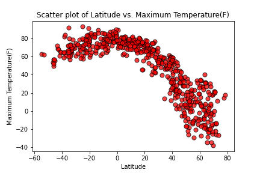
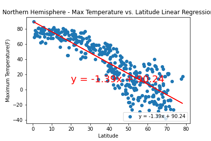
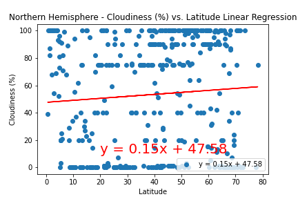

# Python-API-challenge

The task involves Python requests, APIs and JSON traversals and arrive at answers to weather related questions that takes into factors like latitude, temperature, cloudiness and wind speed. The data arrived at in the first part of the assignment is saved in a CSV file and this is used in the second part to create a data frame with ideal weather conditions and find the hotels in that vicinity.

The data analyzed can be summarized as follows:

*  As part of the analysis, the scatter plot was created for the locations based on the latitude and Temperature of the locations. 

The scatter plot clearly depicts that the locations that are closer to the equator has warmer temperatures and the temperatures of the locations reduces when they are farther away from equator.  

* The data was segregated into locations in Northern and Southern Hemispheres. The Northern Hemisphere shows a strong negative correlation between latitude and temperature. 

The correlation coefficient between the latitude and temperature is -0.87. This shows a strong linear trend and proves again that the locations closer to equator are warmer comparatively.

* The correlation was calculated for Latitude and Cloudiness of regions as shown below.

The correlation coefficient was found to be 0.07 and that indicates that the cloudiness of a location has negligible relation with the latitude. The cloudiness for the location were spread across the regions regardless of the latitude.
